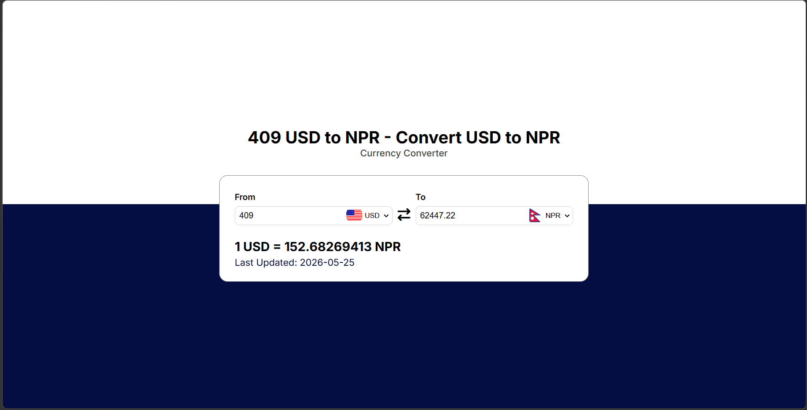
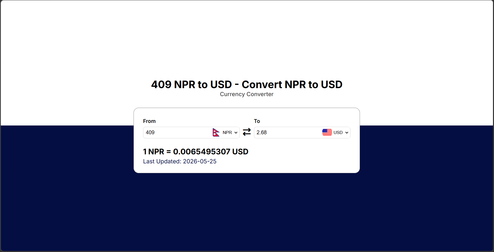

# 💱 Currency Converter

> A clean, responsive currency converter built with vanilla HTML, CSS, and JavaScript — powered by a free live exchange rate API with real-time conversion, flag support, and smart input handling.

---

## 📸 Preview

<p align="center">
  
  
</p>

---

## ✨ Features

- 🌍 **160+ currencies** supported with full dropdown selection
- ⚡ **Live conversion** — updates as you type, no button needed
- 🔄 **Swap button** — instantly reverse the From/To pair and refetch the rate
- 🏳️ **Country flags** — auto-updates on currency change using Flags API
- ⌨️ **Smart input handling**:
  - Resets to `1` automatically after 3 seconds if the field is empty
  - Resets to `1` if a negative number is entered
- 📅 **Last updated** timestamp displayed for every fetched rate
- 📱 **Responsive UI** — works across desktop and mobile

---

## 🛠️ Tech Stack

| Layer | Technology |
|---|---|
| Markup | HTML5 |
| Styling | CSS3 |
| Logic | JavaScript (Vanilla) |
| Icons | Font Awesome 7 |
| Fonts | Google Fonts — Inter |
| Exchange Rates | [fawazahmed0/currency-api](https://github.com/fawazahmed0/currency-api) |
| Country Flags | [flagsapi.com](https://flagsapi.com) |

---

## 📂 Project Structure

```
Currency-Converter/
│
├── index.html        # App structure and layout
├── style.css         # Styling, layout, and responsiveness
├── app.js            # Core logic — API calls, input handling, swap
├── codes.js          # Currency code → country code mapping
└── README.md         # Project documentation
```

---

## ⚙️ How It Works

1. On page load, the app defaults to **USD → NPR** and fetches the live rate immediately
2. Dropdowns are populated from `codes.js` — a mapping of currency codes to country codes
3. Country flags are rendered using the country code via `flagsapi.com`
4. As the user types an amount, `getExchangeRate()` fires and updates the converted value in real time
5. If the input is left empty or set to a negative number, a 3-second debounce timer resets it to `1`
6. The swap button exchanges the From/To currencies, updates both flags, and refetches the rate

---

## 🔗 API Reference

**Currency API** by [fawazahmed0](https://github.com/fawazahmed0/currency-api) — free, no auth required.

```
Base URL : https://cdn.jsdelivr.net/npm/@fawazahmed0/currency-api@latest/v1/currencies
Endpoint : /{fromCurrency}.json

Example  : /usd.json
Response : { "usd": { "npr": 133.45, "eur": 0.91, ... }, "date": "2026-05-26" }
```

**Flags API**

```
https://flagsapi.com/{COUNTRY_CODE}/flat/64.png

Example: https://flagsapi.com/US/flat/64.png
```

---

## 🚀 Getting Started

No build tools or dependencies needed — just open it in a browser.

```bash
# Clone the repo
git clone https://github.com/Empeeror18/Currency-Converter.git

# Open in browser
cd Currency-Converter
open index.html
```

Or simply drag `index.html` into any browser window.

---

## 🧠 Key Implementation Notes

**Debounced input reset** — prevents the field from being stuck empty or negative:
```js
resetTimer = setTimeout(() => {
  amountInput.value = 1;
  getExchangeRate();
}, 3000);
```

**Safe amount parsing** — guards against `NaN` and negative values before every API call:
```js
let amount = parseFloat(amountInput.value);
if (isNaN(amount) || amount <= 0) amount = 1;
```

**Swap logic** — swaps dropdown values, updates both flags, and refetches in one click:
```js
const temp = fromSelect.value;
fromSelect.value = toSelect.value;
toSelect.value = temp;
updateFlag(fromSelect);
updateFlag(toSelect);
getExchangeRate();
```

---

## 🧑‍💻 Author: *[Samrat Aryal](https://github.com/Empeeror18)*


## ⭐ Support

If this project helped you, drop a ⭐ on GitHub — it means a lot!  
Feel free to **fork**, **open issues**, or **submit PRs**.